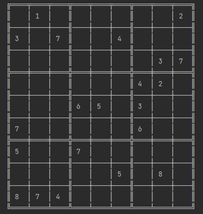

# Sudoku

Classic Sudoku game coded in Python

Table of Contents:

- [Installation](#Installation)
- [Gameplay - Rules](#Gameplay---Rules)
- [Modes](#Modes)
- [Playing Against the Computer](#Playing-Against-the-Computer)
- [Technologies Used](#Technologies-Used)
- [Contributing](#Contributing)

## Installation
For playing you need to:

1- Download the code from this repository.

2- To play this game, you'll need to have Python 3 installed on your machine. If you don't have it, you can download and install it from the official  - Python website: https://www.python.org/downloads/

3- Run main.py in VSC, Pycharm, etc. or open it in console.

## Gameplay - Rules
1. Sudoku is a 9-by-9 grid puzzle in which the grid is divided into 3-by-3 boxes
2. Every row, column and box must contain the numbers 1 through nine 9, no repeats.
3. Most sudoku puzzles come with a few of the boxes already filled in, so you can use those freebie clues as a jumping off point for solving and work backwards. The fewer numbers already filled in, the more difficult it will be.\n"
4. The only hard and fast rule is not to repeat numbers:
» Each row should have numbers 1-9, no repeats.
» Each column should have numbers 1-9, no repeats.
» Each 3x3 box should have numbers 1-9, no repeats.
5. For picking a number in the grid you must follow this order:
First choose a box. Grid is divided in 1-9 boxes.

Then choose a cell in the box. Box is divided in 1-9 cells:

And finally select which number 1-9 you want yo put in each cell. Example: 1 3 8

## Modes
There are three difficulty modes to choose from:

- Easy
- Medium
- Hard
- There is also a two-player mode that allows two human players to play against each other.

## Playing Against the Computer
When playing against the computer, the game uses an artificial intelligence (AI) algorithm to determine the computer's moves. The difficulty level of the AI can be adjusted by selecting a mode before starting the game. 

## Technologies Used
This game was written in Python 3, and makes use of the following modules:

- time: Used for a short pause between moves to make the game feel more natural.
- secrets: Used to generate random AI moves in the easy and medium difficulty modes.
- sqlite3: Used to save scores in a database based on player's name.

## Contributing
This project is open for contributions from anyone who wants to improve it. If you'd like to contribute, feel free to fork the repository, make your changes, and submit a pull request

Enjoy it!

karpo27

Enjoy!

